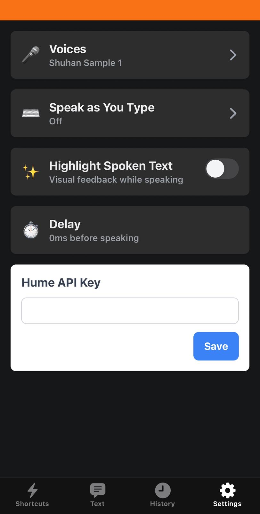

# 🎯 Objective of the Project

This project aims to develop a **text-to-speech (TTS) application capable of expressing emotions**.  
We integrated the **[Hume AI](https://dev.hume.ai)** API to enable real-time emotional speech generation.

## ✨ Features

- **Shortcut sentences** for quick playback.  
- **Emotion-based TTS**, where emojis at the top define the emotional tone of the spoken sentence.  
- **Sentence history** to easily replay previously used phrases.  
- **Settings** section with:
  - Voice selection and the ability to add **custom voices/clone voices**  
  - “**Speak as you type**” mode.  
  - **Highlighting** of the spoken text.  
  - Adjustable **delay** before speech starts.
  - Enable in **phone call** (coming soon)
  - Enable in **App video call** (coming soon)
    

Here is the list of the emojis and the corresponding emotion/tone:

- 😊 Enthusiasm for a job (formal)
- 🤪 Funny/sarcastic
- 🥳 Happy
- 😡 Angry 
- 😢 Sadly/ depression 
- 👩‍🎓 Neutral
- 🫠 Anxious 
- 🤢 Disgusted 
- 🙈 Shy
- 😑 Dont care 
- 🤩 Admire
- 😱 Scared
- 🥺 Awe
- 🤔 Doubt
- 😨 Shock
---

# ⚙️ Installation & Usage

1. **Sign up** on the [Hume AI website](https://dev.hume.ai).  
2. Retrieve your **API key** and enter it in the app’s **Settings** section.  
   - The free plan provides approximately **30 minutes of usage per day/month** (depending on your Hume AI plan).  
3. To use the **TTS feature**:
   - Select the **emoji** corresponding to the emotion you want.  
   - Type the sentence you wish to play.
   - If no emoji is selected, the default tone is neutral.
4. To activate the **“Speak as you type”** option, press **Enter** (Return) after typing your text.  

---

# 🖼️ App Preview

Below are some screenshots of the current version of the application:

  <figure style="display:inline-block; margin:10px;">
    
    <figcaption>Setting section</figcaption>
  </figure>
  <figure style="display:inline-block; margin:10px;">
    
    <figcaption>History of text section</figcaption>
  </figure>
  <figure style="display:inline-block; margin:10px;">
    
    <figcaption>Shortcut section</figcaption>
  </figure>
  <figure style="display:inline-block; margin:10px;">
    
    <figcaption>Text input for TTS</figcaption>
  </figure>

# 🎥 App Demo
The project demo can be viewed via the link below (https://youtube.com/shorts/dpMF2Qc3h5c?si=0dxCHTKZONMK6qOa)

  
  
  # Tacitlity_Real_Emotion

  This is a code bundle for Tacitlity_Real_Emotion. The original project is available at (https://www.figma.com/make/c4oskEAKpcHdVX6O68HvXF/Tactility_Real_Emotion)
  
  ## Running the code

  ### For the the web protopype, in the prototype_react folder: (NOTE: Deprecated, was our first ocncept)
  Run `npm i` to install the dependencies.

  Run `npm run dev` to start the development server.
  ## For the rect native app, (web, ios, android) run the following in the native/ directory:

  `npm i` to install the dependencies
  `npx expo start` to start the development server.
  
